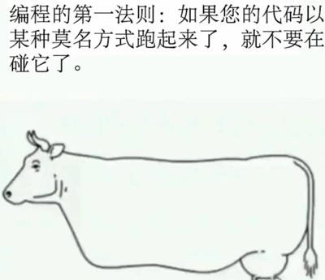
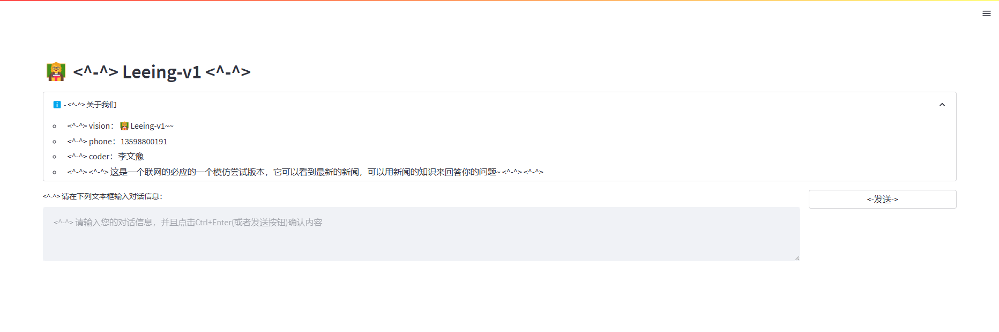
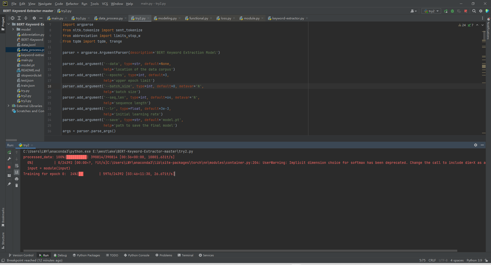
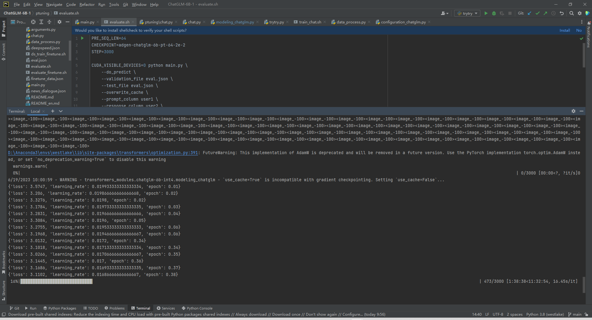
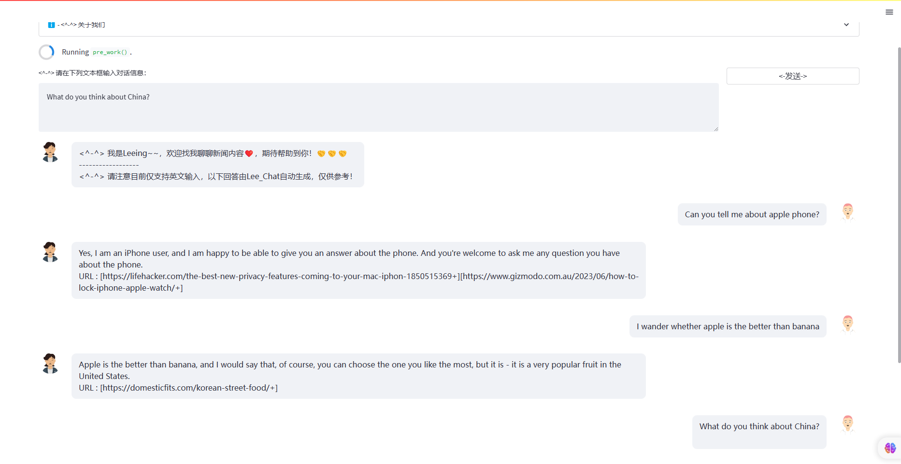
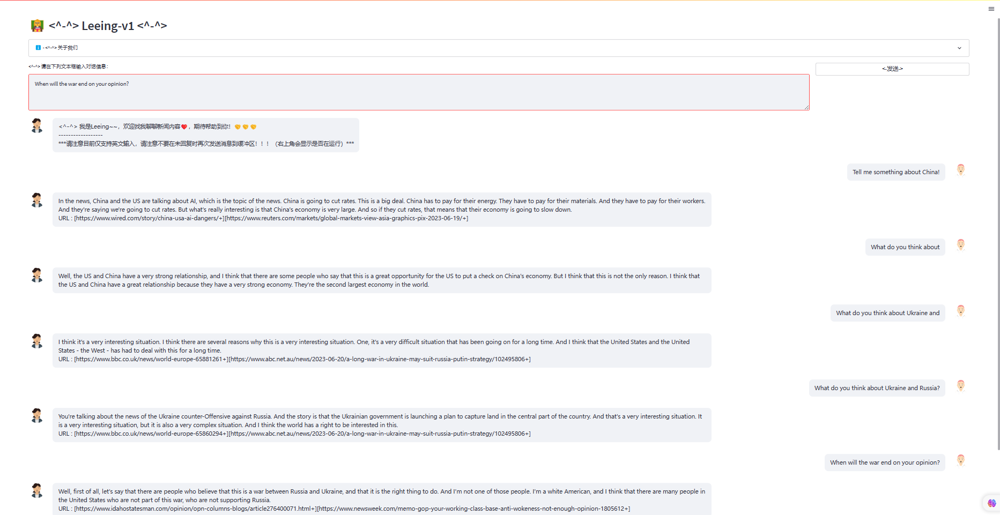

# 👩‍🏫👩‍🏫[“ Leeing ”](https://github.com/lightxxxshadow/Leeing--NewsGPT) —— NewBeing Low-end version👩‍🏫👩‍🏫

<p align="center">
    
</p>

    
**This is a low-profile version of Newbeing, which is linked to the web, and can get the latest daily news through the web interface and answer your questions with the help of these news.**
* A token-level keyword extraction model based on Bert was designed and trained.
* Fine-tune ChatGLM with news interview data for better results.
* Use two news interfaces to extract the latest news and the most matching news respectively, and select the most relevant news as input based on the Dense Retrieval algorithm.
* Realized the demo version test of the web version.

    
<p align="center">
    
</p>

    
## Recently updated    

- 👏🏻  2023.06.20: Leeing-v1 version released. It has realized all basic functions and supports two modes: web version interaction and command line interaction.

    
## How to use
* Experimental environment

python 3.8

GeForce RTX 3090 ，24gMemory

    
* Clone this project
```bash
cd ~
https://github.com/lightxxxshadow/Leeing--NewsGPT.git
```

    
* Install dependencies    
```python
pip install -r requirements.txt
```

It should be noted that the version of Torch needs to be selected according to the actual CUDA version of your server, please refer to [PyTorch Installation Guide](https://pytorch.org/get-started/previous-versions/) for details.    

    
```python    
pip install torch==1.13.1+cu116 torchvision==0.14.1+cu116 torchaudio==0.13.1 --extra-index-url https://download.pytorch.org/whl/cu116
```

* Model download
- You can choose to use your own or the data given below to train your own model, or you can directly use my trained model to test the effect.


    
- [Over here](https://drive.google.com/file/d/1T8H9lq2L2pnzqMSKiwEnR4a7O2PWlXmd/view?usp=sharing)Download the model for keyword extraction, put it in the ./Keyword_Extractor path, and the GPU requires a minimum video memory of about 3G when fine-tuning.

    
<p align="center">
    
</p>

    
- [Over here](https://drive.google.com/file/d/1rRfy7sc2tJ2fyjUWxgnrrU6gi-zyqwwt/view?usp=sharing)Download the prefix partial parameter model of the fine-tuned ChatGLM model based on the following data, and place the entire output folder under the ./chatglm_ptuning path,Just put it under the ./Keyword_Extractor path, and the video memory needs to be about 17G when fine-tuning.


     
<p align="center">
    
</p>


     
- Note that at the same time need to download the [ChatGLM Model](https://github.com/THUDM/ChatGLM-6B) released by Tsinghua University, I chose the smallest 4int-level quantized version here, you can also use it directly without fine-tuning, the video memory consumes 6-7g, and the downloaded entire chatglm-6b-int4 file sister is placed in the same level directory as this README.

    
Note Modify the model path locally in the code!!!

    
* Data download
- In addition to downloading the trained model directly, you can train your own model by yourself through the following method.


    
- [Over here](https://drive.google.com/file/d/12chZA87VUviFyOh1qWs8DI33hbjKsKiv/view)Download the training data of the Bert-based keyword extraction model and format compressed jsonl file.

      
After unzipping, put it in the ./Keyword_Extractor directory, run data_process.py to get train.json data for training, and there are about 30,000 pieces of data after processing and cleaning.

    

- [Over here](https://drive.google.com/file/d/1ZAKZM1cGhEw2A4_n4bGGMYyF8iPjLZni/view)Download the data for fine-tuning the ChatGLM model, which is a multi-round dialogue data of news interviews in English, which is very suitable for this task.

      
After extracting, put it in the ./chatglm_ptuning directory, and run two functions in the data_process.py: process1 and process2 respectively to obtain train.json data for training.


    
- Due to the time and computing power of the model, the fine-tuning of the model Chat_GLM only used about 20,000 rounds of training data with context information, less than 1% of the total data volume.


    
* Start the service   

This project provides [demo_show.py](./demo_show.py) as an example of using the Leeing model, find the file path, and use the following command to start the service:    

```bash
streamlit run demo_show.py
```

In particular, at least 7 gigabytes of video memory are required to run on the web side, otherwise it may not run. When running, because the news API used is an overseas website, you need to circumvent the wall and enable overseas services.
Pay special attention to the installation package before running:    

```python
pip install streamlit
pip install streamlit_chat
```

<p align="center">
    
</p>


    
<p align="center">
    
</p>

    
## Reference repository
```bib
@misc{chen2023soulchat,
      title={灵心健康大模型SoulChat：通过长文本咨询指令与多轮共情对话数据集的混合微调，提升大模型的“共情”能力},
      author={Yirong Chen, Xiaofen Xing, Zhenyu Wang, Xiangmin Xu},
      year={2023},
      month = {6},
      version = {1.0},
      url = {https://github.com/scutcyr/SoulChat}
}
```
```bib
@article{zeng2022glm,
  title={Glm-130b: An open bilingual pre-trained model},
  author={Zeng, Aohan and Liu, Xiao and Du, Zhengxiao and Wang, Zihan and Lai, Hanyu and Ding, Ming and Yang, Zhuoyi and Xu, Yifan and Zheng, Wendi and Xia, Xiao and others},
  journal={arXiv preprint arXiv:2210.02414},
  year={2022}
}
```
```bib
@misc{Rahul1582，
      title={BERT-Keyword-Extractor},
      author={BERT-Keyword-Extractor, Xiaofen Xing, Zhenyu Wang, Xiangmin Xu},
      year={2019},
      month = {5},
      url = {https://github.com/ibatra/BERT-Keyword-Extractor}
}
```
